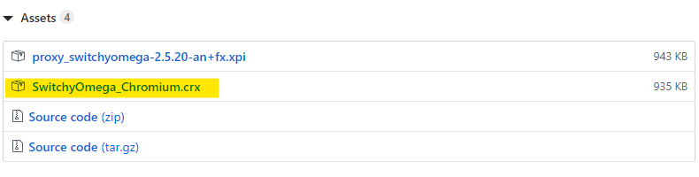
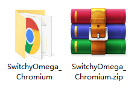
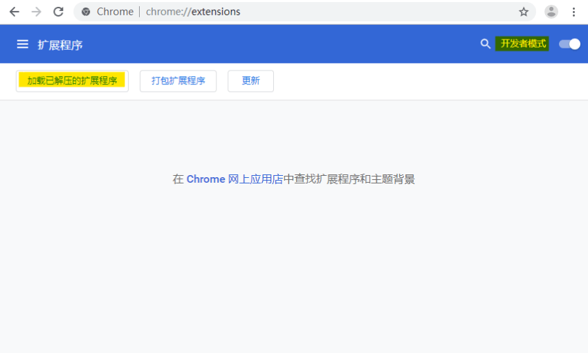
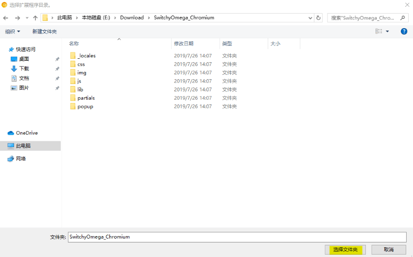
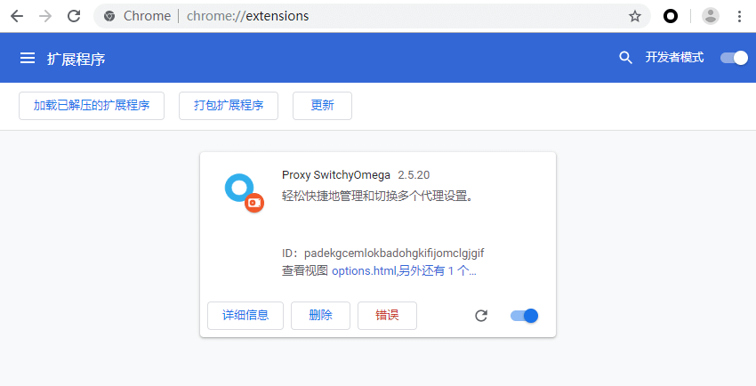

1. 首先下载扩展离线安装文件文件
访问 https://github.com/FelisCatus/SwitchyOmega/releases 的发布页面，页面滚动到下方，找到 SwitchyOmega_Chromium.crx，点击链接下载 crx 文件。  

2. 将下载好的 SwitchyOmega_Chromium.crx 文件的扩展名改为zip，用解压缩软件解压到目录中。   

3. 在 Chrome 中访问 chrome://extensions/ 打开扩展程序页面。

4. 首先开启右上角的 开发者模式 ，然后点击左侧出现的 加载已解压的扩展程序 ，在弹出的窗口中选择第二步中解压的 SwitchyOmega_Chromium 文件夹   
   

5. 这时地址栏的右侧会看到一个黑色的圆圈就表示 Proxy SwitchyOmega 安装成功了，之后参考 [Chrome 的配置教程](7-2-chrome-setup-guide-cn.md) 导入我们提供的配置文件即可。
（虽然会提示有错误，但是不影响正常使用）  

