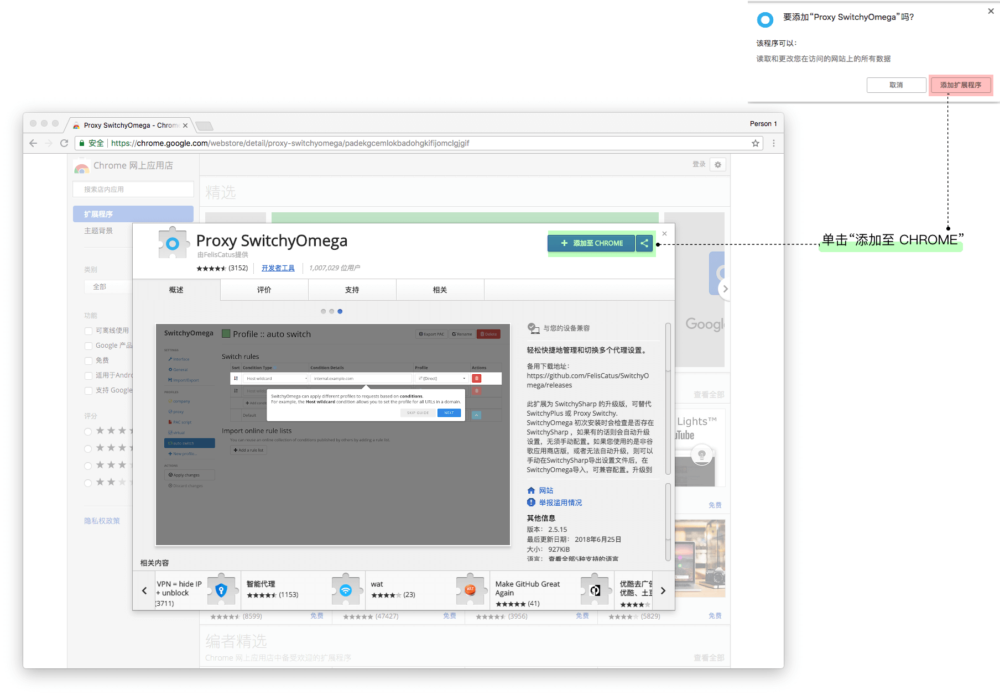
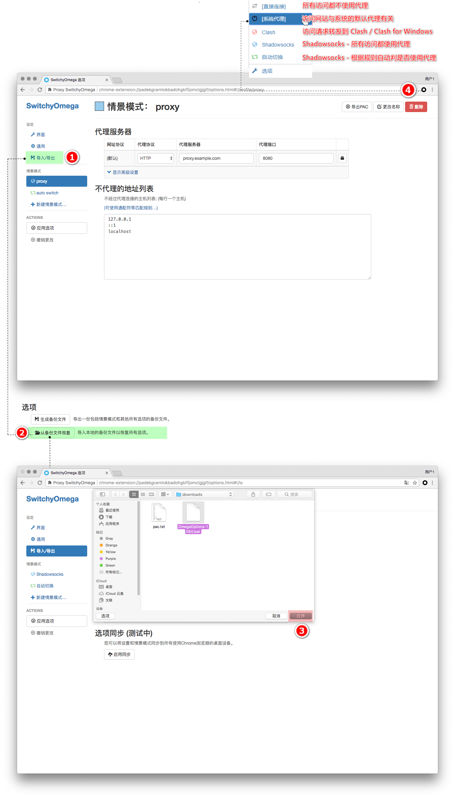
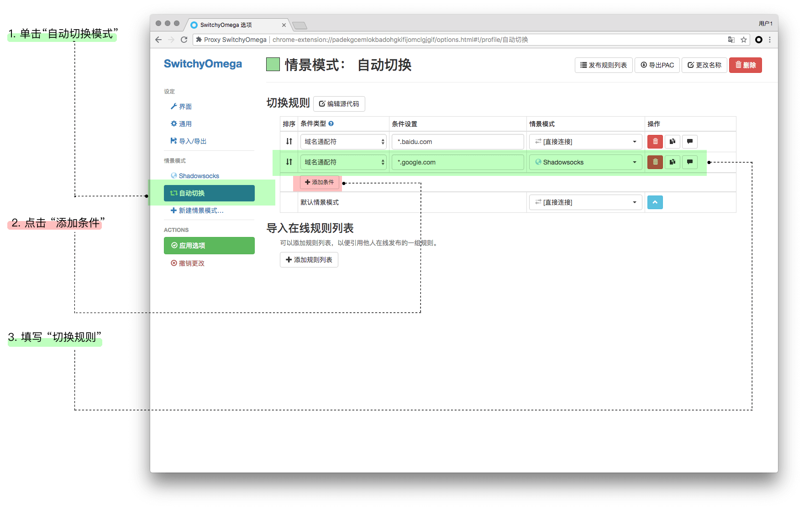

# Chrome + Proxy SwitchyOmega 设置

**这里假设您已经配置好 Shadowsocks 客户端，具体请参考**  
**Shadowsocks:**   
- [Windows 下安装配置 Shadowsocks 使用教程](../../zh_CN/shadowsocks/windows-setup-guide.md)
- [macOS 下安装配置 Shadowsocks 使用教程](../../zh_CN/shadowsocks/macos-setup-guide.md)
- [Linux 下安装配置 Shadowsocks 使用教程](../../zh_CN/shadowsocks/linux-setup-guide.md)    

**Shadowsocks & V2ray[Vmess]:**
* [Windows 下 Clash for Windows 使用教程](../../zh_CN/v2ray/clash-for-windows-setup-guide.md)
* [macOS 下 ClashX 使用教程](../../zh_CN/v2ray/clashx-macos-setup-guide.md)

## 安装扩展

* 您可以通过chrome商店安装 [Proxy SwitchyOmega](https://chrome.google.com/webstore/detail/padekgcemlokbadohgkifijomclgjgif) 扩展。

* 单击“添加至 CHROME” >  单击 “扩展应用程序”。

 

**如果无法访问**

Chrome / Chromium  72 以上版本无法直接拖放安装，手动安装方法请参考：
[浏览器设置教程 - Chrome 手动安装 SwitchyOmega](../../zh_CN/browser/chrome-install-proxyswitchyomega-offline.md)

## 扩展的配置

**「推荐」** 可以直接使用本站提供的已经设置好的备份直接恢复配置。

通过右侧链接下载 SwitchyOmega 的配置文件： [SwitchOmega + GFWList 自动切换配置文件](https://raw.githubusercontent.com/Shadowsocks-Wiki/shadowsocks/master/assets/OmegaOptions-1080.bak)

**注：使用该备份文件时，shadowsocks 客户端的本地 socks 监听端口应当设置为 1080** 

* 点击 “Proxy SwitchyOmega” > "选项" > "导入/导出" > "从备份文件中恢复" 。
* 选择刚才下载的配置文件 > "打开"。
* 点击 "Switchyomega" 图标， 可以看到如下几个模式：

|连接方式|功能|
|:--------:|:--------:|
|直接连接|所有访问都不使用代理。|
|系统代理|访问网站与系统的默认代理有关。|
|Clash|**ClashX / Clash For Windows** 直接选择这个模式使用。 |
|Shadowsocks| **Shadowsocks** - 所有访问都使用代理。|
|自动切换| **Shadowsocks** - 根据规则自动判是否使用代理 |

>Clash / Clash For Windows 自带规则判断，因此选择 Clash 模式使用即可。    
其他 Shadowsocks 客户端可以根据情况选择 Shadowsocks 或是自动切换模式使用。

> 本站提供的配置使用了 "GFWList", 可以使大部分无法直接访问的网站默认使用代理，推荐日常使用， 在下文中会包含 "自定义配置规则"。

 

## 自定义规则 适用于 Shadowsocks 客户端

* 点击"自动切换模式" > "添加条件"。

* 条件类型选择： "域名通配符"。
* 条件设置填写： "*.域名".
* 情景模式： 选 "Shadowsocks" 则经过代理， 选 “直接连接” 则不经过代理。

