# 如何使用我们的[网站](https://portal.shadowsocks.nl)

## 快速检索
- [如何使用我们的网站](#如何使用我们的网站)
  - [快速检索](#快速检索)
  - [版本区别](#版本区别)
  - [注册与购买](#注册与购买)
  - [登陆账户](#登陆账户)
  - [查看节点信息](#查看节点信息)
  - [下载配置文件](#下载配置文件)
  - [查看节点二维码](#查看节点二维码)
  - [使用教程](#使用教程)

## 版本区别
||[**Trojan Lite**](https://portal.shadowsocks.nl/cart.php?a=confproduct&i=1)|[入门版](https://portal.shadowsocks.nl/cart.php?a=confproduct&i=4)|[高级版](https://portal.shadowsocks.nl/cart.php?a=confproduct&i=3)|[旗舰版](https://portal.shadowsocks.nl/cart.php?a=confproduct&i=2)|[企业版](https://portal.shadowsocks.nl/shadowsocks-enterprise)|  
|:-:|:-:|:-:|:-:|:-:|:-:|
|协议|**Trojan**|Shadowsocks|Shadowsocks|Shadowsocks|定制|
|价格（年付）|19.95 澳元|19.95 澳元|79.95 澳元|99.95澳元|2999.95 / 4999.95澳元|
|价格（月付）|×|×|×|12.95 澳元|299.95 / 499.95澳元|
|服务器数量|**40+**|10+|15+|20+|定制线路|
|普通线路|√|√|√|√|定制服务器|
|高级线路|||√|√||
|中转/专线线路|||1|√||
|在线设备数量|**2**|1|**5**|**5**|无限制|
|IPv6节点|√||||定制|
|流量配额/月¹|**100GB+**|60GB+|100GB+|100GB+|无限制|
|备注|**一般情况 推荐购买该版本**|适合只偶尔 使用的用户|适合使用较频繁且 有多个设备同时使 用的用户|适合对速度需 求较高的用户|**中港专线(5-10Mbps) 可以定制带宽**|
|订购链接|[立即购买](https://portal.shadowsocks.nl/cart.php?a=confproduct&i=1)|[立即购买](https://portal.shadowsocks.nl/cart.php?a=confproduct&i=4)|[立即购买](https://portal.shadowsocks.nl/cart.php?a=confproduct&i=3)|[立即购买](https://portal.shadowsocks.nl/cart.php?a=confproduct&i=2)|[立即购买](https://portal.shadowsocks.nl/shadowsocks-enterprise)| 

注1：统计流量 = 实际使用流量 x 节点倍率，所以根据使用的节点的统计倍率 (0.01-2.0) 的不同，可以使用的流量入门版最多可以为 6000GB ，Trojan Lite/高级版/旗舰版为 10000GB

## 注册与购买

* 如果没有本站的账号，购买过程中将自动创建账户。
* 打开 [https://shadowsocks.nl/](https://shadowsocks.nl/)并点击 [Order Now](https://portal.shadowsocks.nl/link.php?id=5)，即可查看我们的产品列表。  
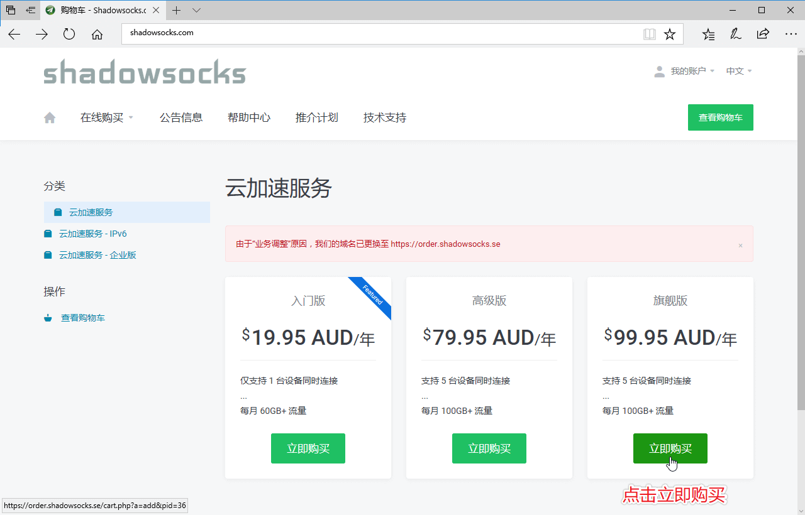

* 选择想要购买的服务后点击对应的 **立即订购** ，进入订单概观, 我们以旗舰版为例，选择付款周期后点击继续加入购物车   
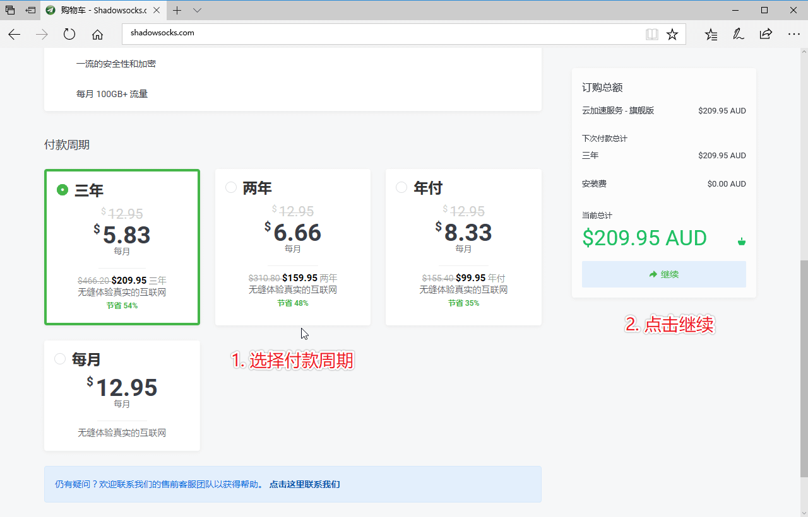  

* 进入结账界面:
1. 可以 **确认您的订单信息** ，如果您持有优惠码，也可以在这个页面输入
2. 然后在下面新建账户部分 **填写必要的账户信息** 后创建新账户并与您的服务关联
3. 选择您方便的付款方式
4. **阅读并勾选同意我们的服务条款** 后点击右侧结账按钮前往付款页面
5. 支付账单后您的服务将会自动开通
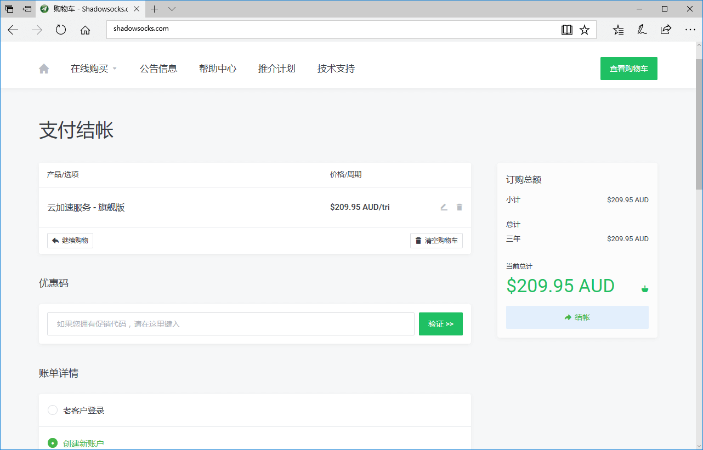

**您可以选择希望使用的付款方式，我们当前提供的支付方式有**

- Wechat（仅支持中国境内用户）
- Alipay 支付宝国际版 （仅支持中国境内用户）
- PayPal （支持全球用户）
- BitCoin / 比特币
- 信用卡 / Credit Card  

(我们的结算货币为澳元，使用 Wechat/Alipay 可以使用人民币支付对应账单)

## 登陆账户
登陆 [客户中心](https://portal.shadowsocks.nl) ,执行下列操作：

* 点击右上角 “登入”。  
* 填写 "Email 地址" 和 “密码” > 点击 “登入”。  

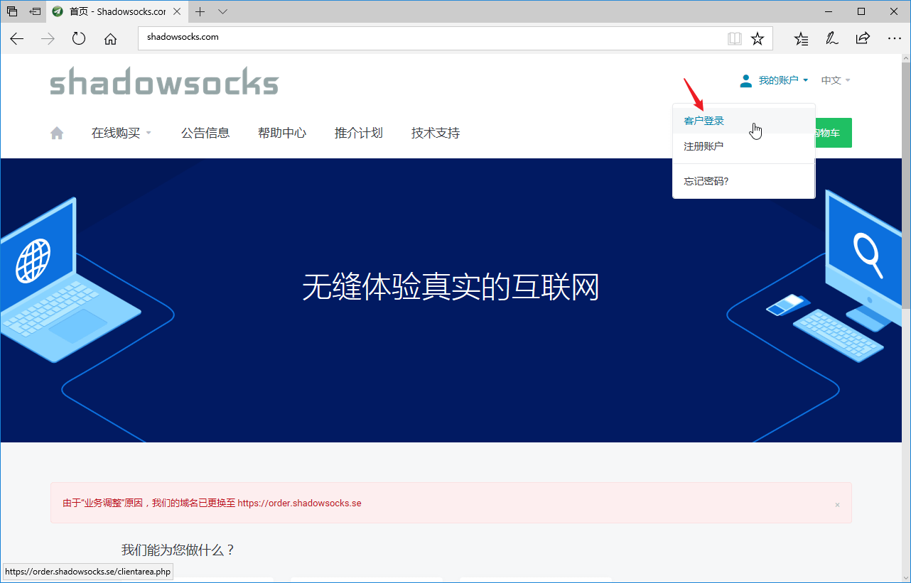  

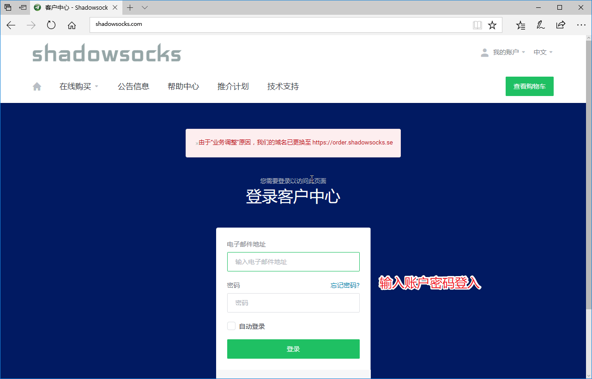

## 查看节点信息
登陆 [客户中心](https://portal.shadowsocks.nl) ,执行下列操作：  

- 单击 “服务” > "我的服务" > 选择 "你可用的产品/服务"。
- 查看你的节点信息。

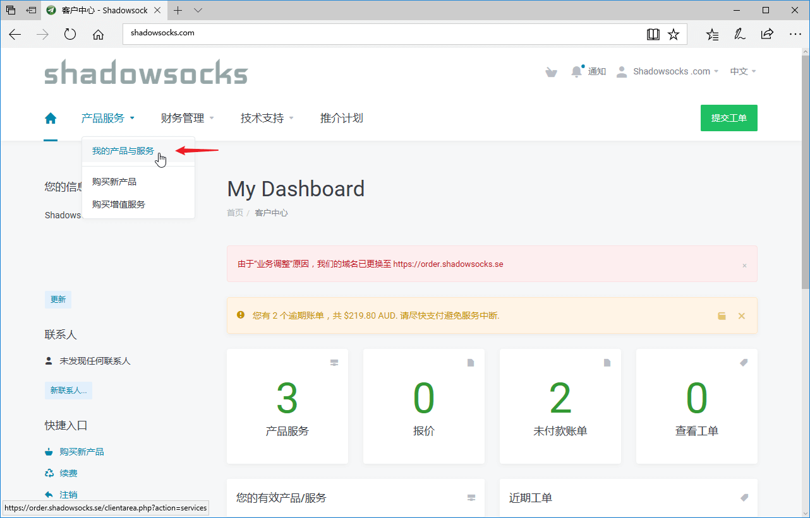  

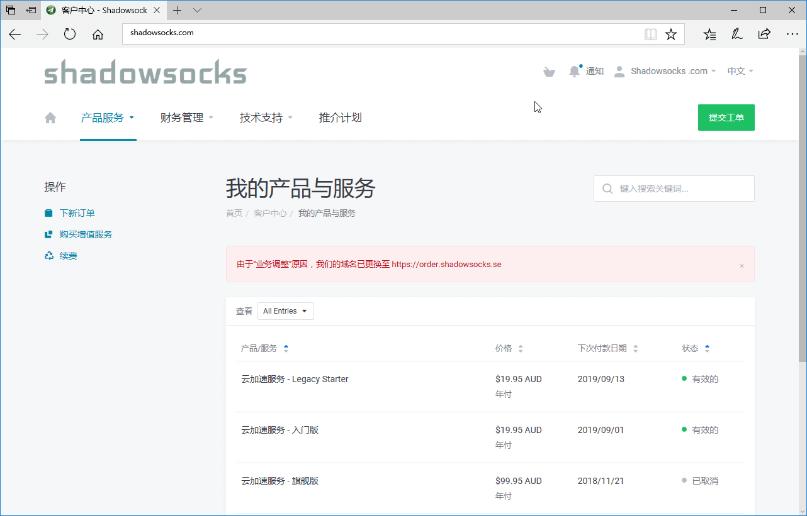  

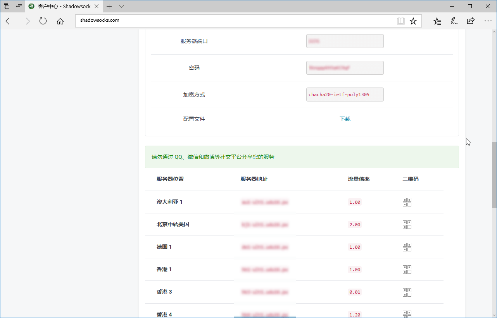  

## 下载配置文件
登陆 [客户中心](https://portal.shadowsocks.nl) ,执行下列操作：

- 单击 “服务” > "我的服务" 。

- 选择 你可用的产品/服务 > "配置文件" > "下载" > "下载 Shadowsocks Windows 版本配置文件"。

- 即可下载到一个 `gui-config.json` 的文件。

  

  

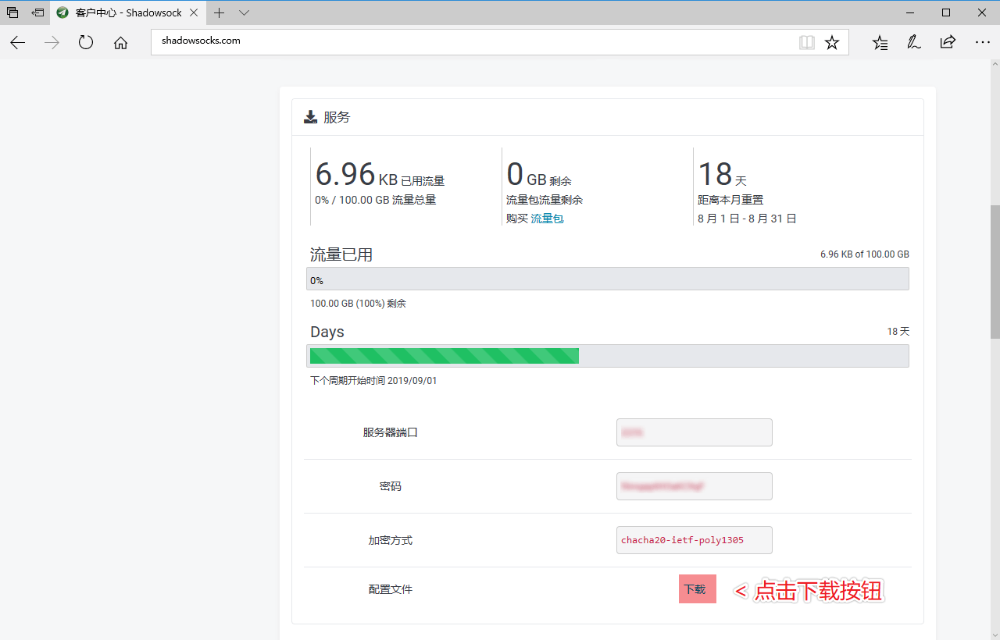

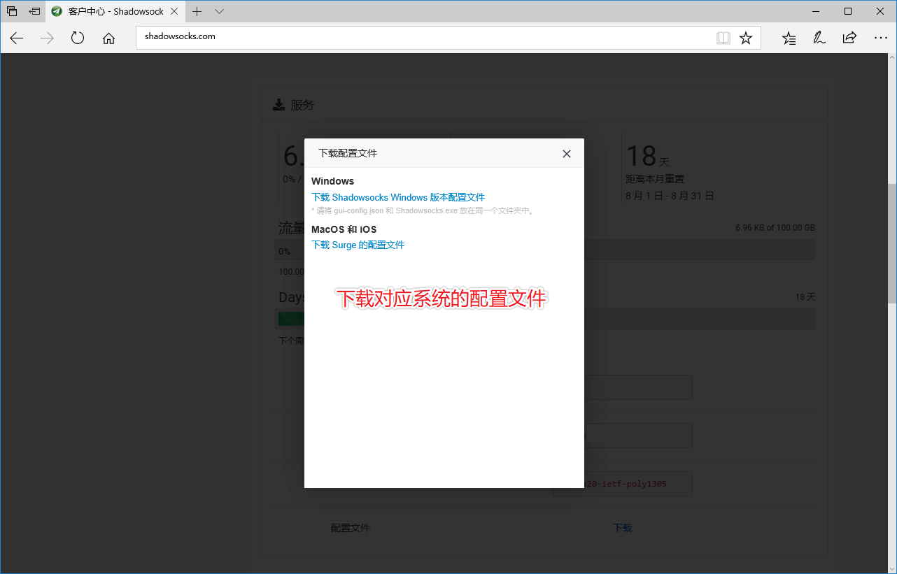

## 查看节点二维码

登陆 [客户中心](https://portal.shadowsocks.nl) ,执行下列操作：

- 单击 “服务” > "我的服务" > 选择 "你可用的产品/服务"。
- 查看你的节点信息 > 点击 ”二维码“ 图标，显示二维码。

  

  

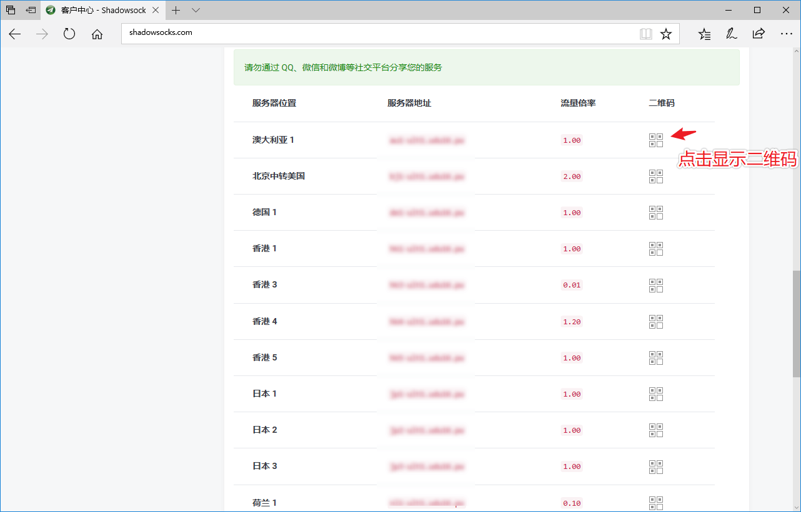

## 使用教程
**Trojan:**
- [Trojan 服务自助更换](https://portal.shadowsocks.nl/knowledgebase/152/)
- [Shadowsocks Portal Trojan 服务设置教程索引(Android / iOS)](https://portal.shadowsocks.nl/knowledgebase/151/)  
- [Windows 下 Trojan-QT5 使用教程](https://portal.shadowsocks.nl/knowledgebase/161/)  
- [macOS 下 Trojan-QT5 使用教程](https://portal.shadowsocks.nl/knowledgebase/162/)  
- [Linux 下 Trojan 命令行使用教程](https://portal.shadowsocks.nl/knowledgebase/160/)  

**Shadowsocks:**  
- [Windows 下安装配置 Shadowsocks 使用教程](../zh_CN/shadowsocks/windows-setup-guide.md)  
- [macOS 下安装配置 Shadowsocks 使用教程](../zh_CN/shadowsocks/macos-setup-guide.md)  
- [iOS 下安装配置 Shadowsocks 使用教程](../zh_CN/shadowsocks/ios-setup-guide.md)  
- [Android 下安装配置 Shadowsocks 使用教程](../zh_CN/shadowsocks/android-setup-guide.md)
- [Linux 下安装配置 Shadowsocks 使用教程](../zh_CN/shadowsocks/linux-setup-guide.md)

**Shadowsocks & V2ray[Vmess]:**
* [Windows 下 Clash for Windows 使用教程](../zh_CN/v2ray/clash-for-windows-setup-guide.md)
* [Windows 下 V2rayN 使用教程](../zh_CN/v2ray/v2ray-win-v2rayN.md)
* [macOS 下 ClashX 使用教程](../zh_CN/v2ray/clashx-macos-setup-guide.md)
* [Android 下 V2rayNG 使用教程](../zh_CN/v2ray/v2ray-android-v2rayNG.md)

**浏览器设置：**
- [Chrome 设置教程 (Proxy SwitchyOmega) ](../zh_CN/browser/chrome-setup-guide.md)
- [Firefox Quantum 设置教程 (Proxy SwitchyOmega)](../zh_CN/browser/firefox-setup-guide.md)
