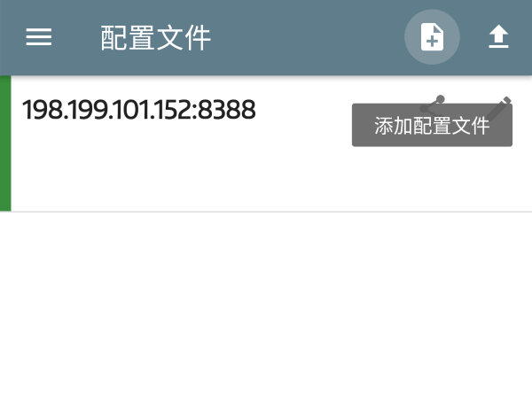
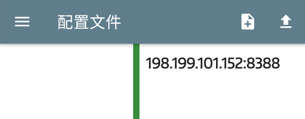
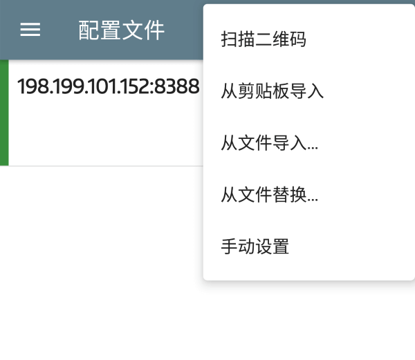
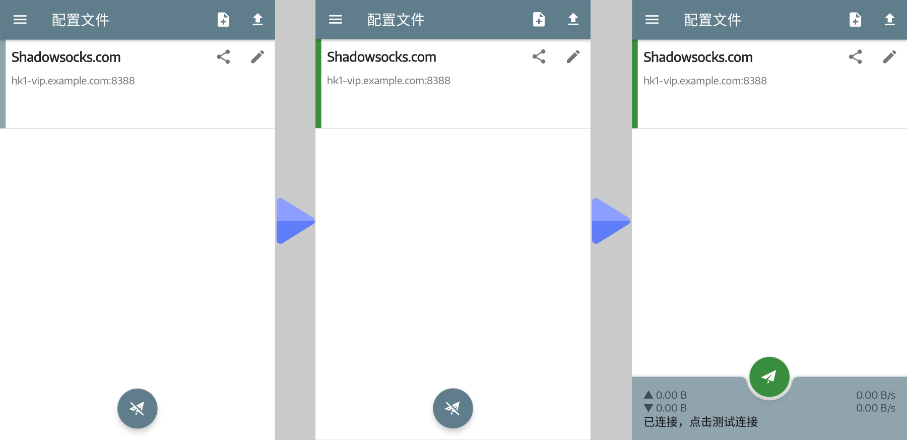
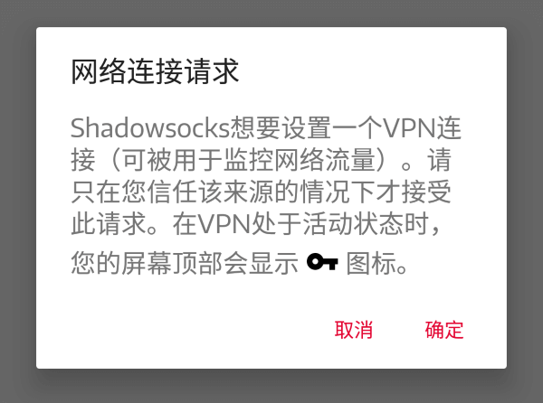
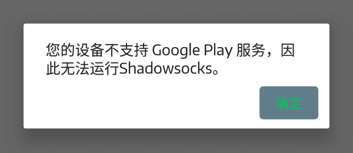
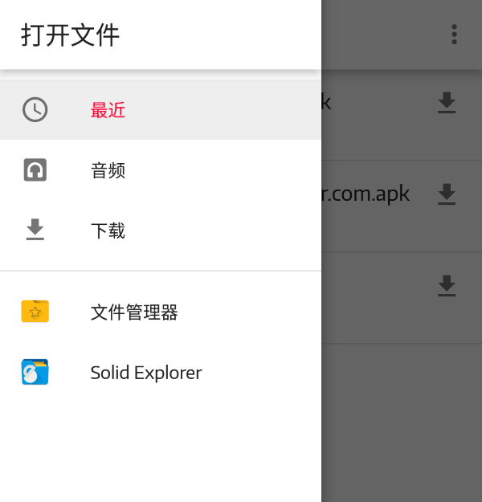
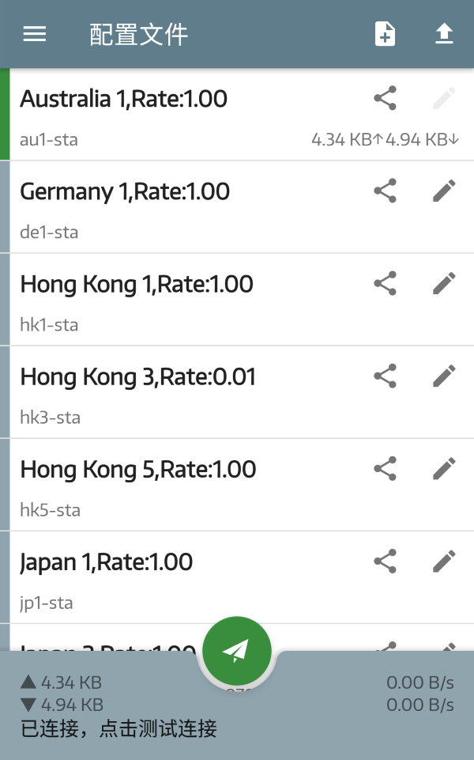
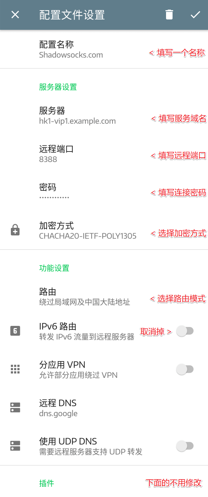
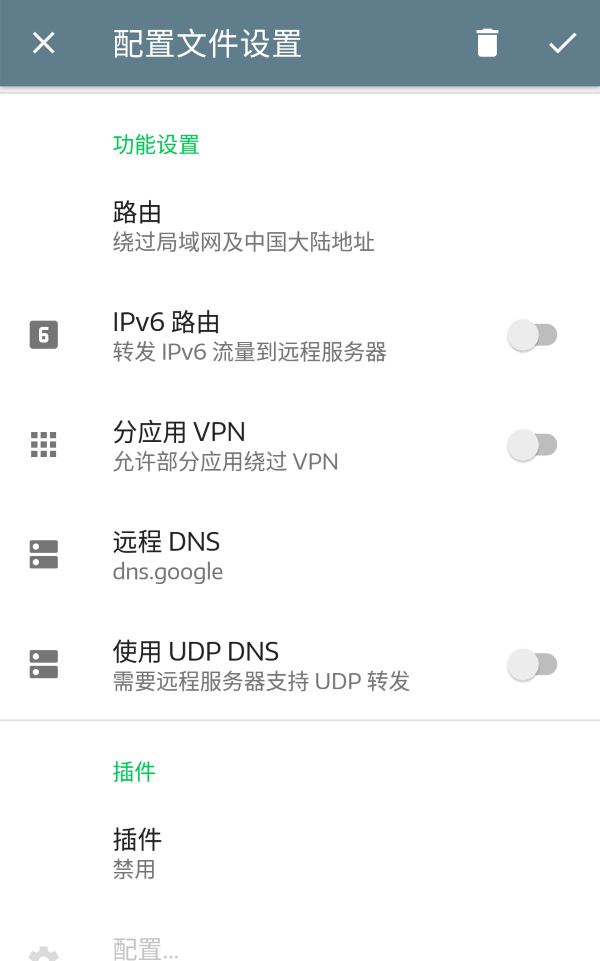

# Shadowsocks 设置方法 (Android)

- [Shadowsocks 设置方法 (Android)](#shadowsocks-设置方法-android)
  - [一、下载客户端](#一下载客户端)
  - [二、获取 Shadowsocks 账号信息](#二获取-shadowsocks-账号信息)
  - [三、配置 Shadowsocks 客户端](#三配置-shadowsocks-客户端)
      - [1. 通过扫描二维码方式添加节点](#1-通过扫描二维码方式添加节点)
      - [2. 通过导入 `gui-config.json` 批量添加节点](#2-通过导入-gui-configjson-批量添加节点)
      - [3. 手动添加节点](#3-手动添加节点)
  - [四、其他说明](#四其他说明)

## 一、下载客户端 
1. 通过 [客户中心](https://portal.shadowsocks.nl/index.php?rp=/download/category/1/Shadowsocks-.html) 下载 APK 文件进行安装  
2. 通过 [Google Play](https://play.google.com/store/apps/details?id=com.github.shadowsocks) 安装客户端  
3. 通过 [Github](https://github.com/shadowsocks/shadowsocks-android/releases) 下载 APK 文件进行安装  

## 二、获取 Shadowsocks 账号信息

详见 [购买流程以及查看账号信息](../../zh_CN/introduction-of-client-portal.md)

## 三、配置 Shadowsocks 客户端

安装完成后，打开 Shadowsocks 应用程序界面，右上角点击 `+` 按钮可以添加节点，底部纸飞机按钮可以链接或断开节点  
客户端自带一个 `198.199.101.152:8388` 的节点，该节点与我们无关，且使用该节点主界面会出现广告，左右滑动可以删除

   

   

我们按下右上方 `+` 按钮进入配置节点界面，弹出的菜单中可以选择需要的配置方式  

#### 1. 通过扫描二维码方式添加节点
使用其他设备执行下列操作，用于显示二维码：
**访问 [客户中心使用指南（点我查看）](../../zh_CN/introduction-of-client-portal.md#查看节点二维码) 了解如何使用我们的网站查看二维码。**

在添加方式中选择 `扫描二维码`

添加完成后，点击选中节点，然后点击底部的连接按钮  
  

初次连接时请求 VPN 权限，点击确认允许，否则无法连接。  

注1： 新版本客户端扫描二维码时需要手机已安装 Google Play 服务，否则会提示错误  

建议选择其他方式添加节点或是下载 4.2.5 版本客户端： [下载链接](https://github.com/shadowsocks/shadowsocks-android/releases/tag/v4.2.5)  
该版本客户端填写端口时点击一下即可手动填写

#### 2. 通过导入 `gui-config.json` 批量添加节点

先下载 `gui-config.json` 文件，然后点击添加菜单中的 `从文件导入......`  
**访问 [客户中心使用指南（点我查看）](../../zh_CN/introduction-of-client-portal.md#下载配置文件) 了解如何使用我们的网站下载 `gui-config.json`文件。**

选择刚才下载 `gui-config.json` 文件后即可自动添加(节点地址做了隐藏处理)  
点击选择一个节点后，然后点击底部的连接按钮  

#### 3. 手动添加节点
**访问 [客户中心使用指南（点我查看）](../../zh_CN/introduction-of-client-portal.md#查看节点信息) 了解如何查看节点信息。**

点击添加菜单中的 `手动设置` 然后按照下图的说明添加节点  
  

添加完成后，点击选中节点，然后点击底部的连接按钮  
  

## 四、其他说明
- 路由  
在您信息配置完成后，我们推荐在功能设置中设置「绕过局域网及中国大陆地址」，该模式可以实现自动代理
全局模式表示所有流量都会经过代理

-  IPv6 路由
开启后可能导致 Facebook / Insgram APP 无法正常使用

- 分应用 VPN
开启后可以选择仅代理部分 APP ，不过由于 APP 之间存在互相调用的情况，可能出现部分功能无法正常使用，不推荐启用

