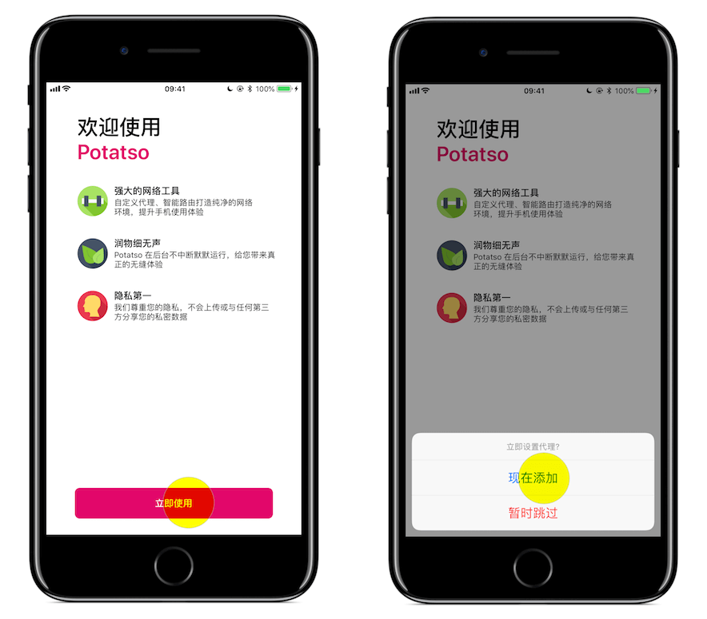
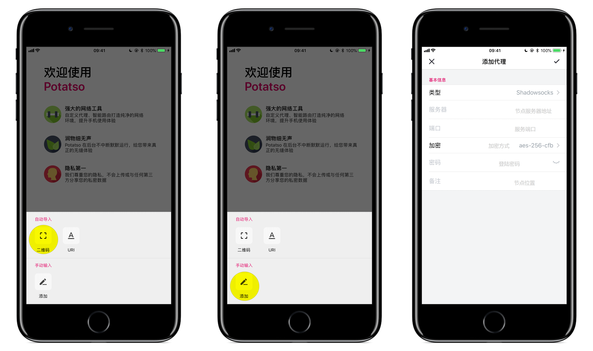
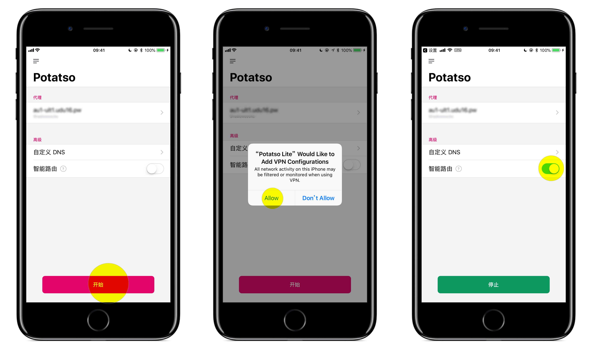
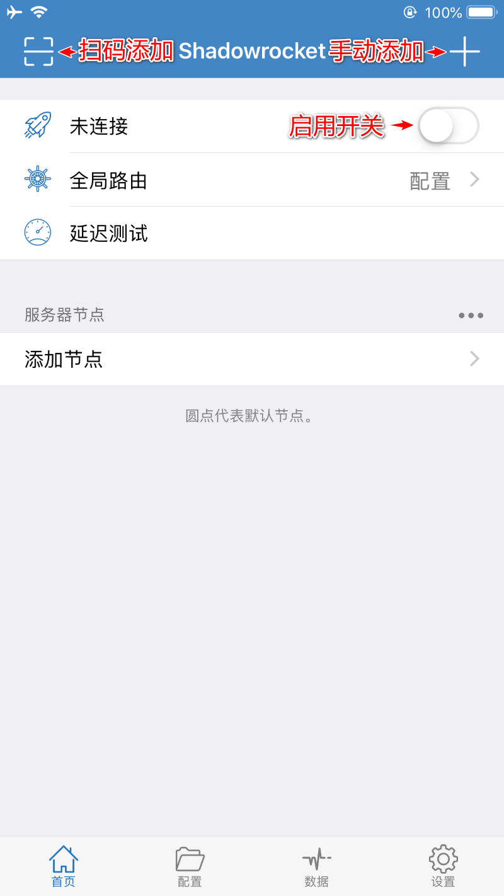
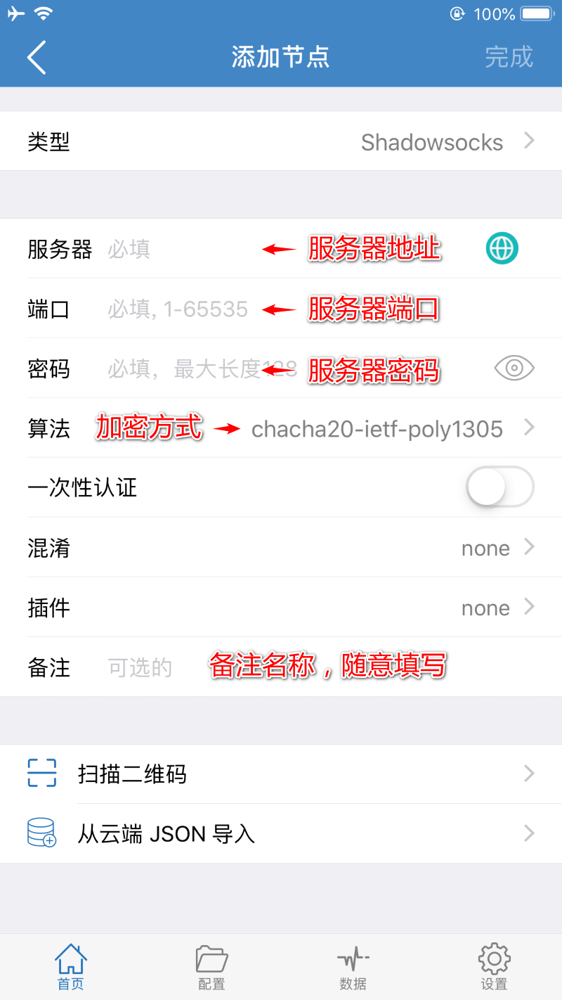

# Shadowsocks 设置方法 (iOS)
- [Shadowsocks 设置方法 (iOS)](#shadowsocks-设置方法-ios)
  - [系统要求](#系统要求)
  - [客户端下载](#客户端下载)
  - [Shadowsocks 配置 - Potatso Lite](#shadowsocks-配置---potatso-lite)
  - [Shadowsocks 配置 - Shadowrocket](#shadowsocks-配置---shadowrocket)

## 系统要求
**在安装之前，请始终确保您的系统满足最低系统要求。**

您需要具备 iOS 10.0  或更高版本才能运行 Shadowrocket / Potatso Lite。 如果您的 iOS 系统版本较旧， 则请先升级 iOS 10.0 或更高版本

## 客户端下载

请使用 **非中国大陆地区** 的 Apple ID 搜索并购买应用，本站并不提供Apple ID，也不提供破解版的 App。   
下面链接对应的为美国地区的客户端链接。 

* [Potatso Lite](https://itunes.apple.com/us/app/potatso-lite/id1239860606?mt=8) （免费）
* [Shadowrocket](https://itunes.apple.com/us/app/shadowrocket/id932747118?mt=8) （收费）
* [Potatso 2](https://itunes.apple.com/us/app/potatso-2/id1162704202?mt=8)（收费）

**App Store 上的 App 由其作者进行维护，并非由我们开发，如有疑问，请联系其作者。**

## Shadowsocks 配置 - Potatso Lite

登陆我们的[网站](https://portal.shadowsocks.nl), 执行下列操作：

* 单击 “服务” > "我的服务" > 选择 "你可用的产品/服务"。

* 查看你的节点信息。

Potatso Lite 的设置过程：

* 从 App Store 安装后打开 Potatso Lite。
* 点击 "立即使用" > "现在添加"。

**扫码配置**

* 点击 "二维码" > "Potatso Lite 想访问您的相机"的窗口，选择 "好" > 扫描你节点的二维码，节点将自动添加成功。

**手动配置**

* 点击 "添加" > 填写代理。
* 选择 "Shadowsocks“ > 填写 "服务器" > 填写 "端口" > 选择 "加密" > 填写 "密码" 。
* 填写 "备注" 为可选项 > 点击右上角的 "✔"， 设置完成。

**开始代理**

* 点击 "开始" > 选择 "Allow" > 开启 "智能路由"。
* 当看到左上角出现 VPN 字样时，代表连接成功。
* **智能路由** 表示可以实现自动代理， 及本来可以访问的网站不会经过代理，推荐日常使用。

## Shadowsocks 配置 - Shadowrocket

下载安装后打开 Shadowrocket

点击 `添加节点` 即可添加您的节点信息

**扫码配置**
点击左上方扫码图标即可通过扫描二维码添加配置

**手动配置**
点击右上方 + 后按照提示配置

在您完成配置后请到 Shadowrocket 的首页界面点击启用开关开启服务，第一次运行时会请求设置 VPN 的权限，请选择允许（Allow）。

如需要关闭 Shadowsocks，打开 Shadowrocket 的首页点击滑块即可关闭。
