# Shadowsocks 设置方法 (Windows)
- [Shadowsocks 设置方法 (Windows)](#shadowsocks-设置方法-windows)
  - [系统要求](#系统要求)
  - [安装 Shadowsocks](#安装-shadowsocks)
      - [1. 下载客户端](#1-下载客户端)
      - [2. 解压客户端](#2-解压客户端)
  - [配置 Shadowsocks 账号](#配置-shadowsocks-账号)
      - [通过复制 gui-config.json 文件批量添加](#通过复制-gui-configjson-文件批量添加)
      - [通过二维码方式单独增加节点](#通过二维码方式单独增加节点)
  - [配置系统代理模式](#配置系统代理模式)
  - [注意事项](#注意事项)
  - [4.1.5 及更低版本客户端的系统代理选项界面](#415-及更低版本客户端的系统代理选项界面)
  - [配置 Firefox 的代理](#配置-firefox-的代理)
  - [配置 Chrome 的代理](#配置-chrome-的代理)

## 系统要求
**在安装之前，请始终确保您的系统满足最低系统要求。**

您需要具备 Windows 7 SP1 或更高版本才能运行 Shadowsocks。如果您的操作系统版本较旧， 则请先升级到  Windows 7 SP1 或更高版本。

**NET Framework**: 如果你的计算机未安装.NET Framework, 请点击 [这里](https://www.microsoft.com/zh-tw/download/details.aspx?id=53345) 下载最新版本的 .NET Framework。

## 安装 Shadowsocks

按照下面的说明在 Windows 中下载并安装 Shadowsocks。

#### 1. 下载客户端

可以前往 [客户中心](https://portal.shadowsocks.nl/index.php?rp=/download/category/1/Shadowsocks-.html) 下载客户端  

或是访问 Shadowsocks Windows 客户端 [下载页面](https://github.com/shadowsocks/shadowsocks-windows/releases)。
下载最新版本的 `Shadowsocks-x.x.x.zip`  (`x.x.x`为版本号) 。

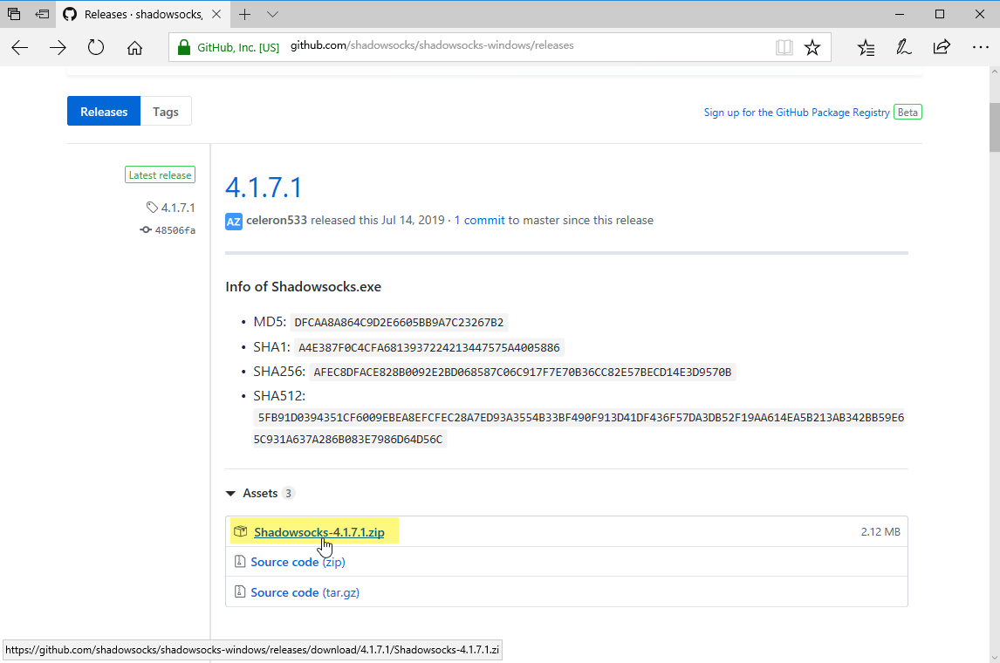

#### 2. 解压客户端

右键 `Shadowsocks-x.x.x.zip` 压缩文件 > "全部解压缩"。
点击 "浏览" 选择想要解压到的文件目录 > "完成时显示提取的文件" > "提取"。
双击运行 `Shadowsocks.exe`。

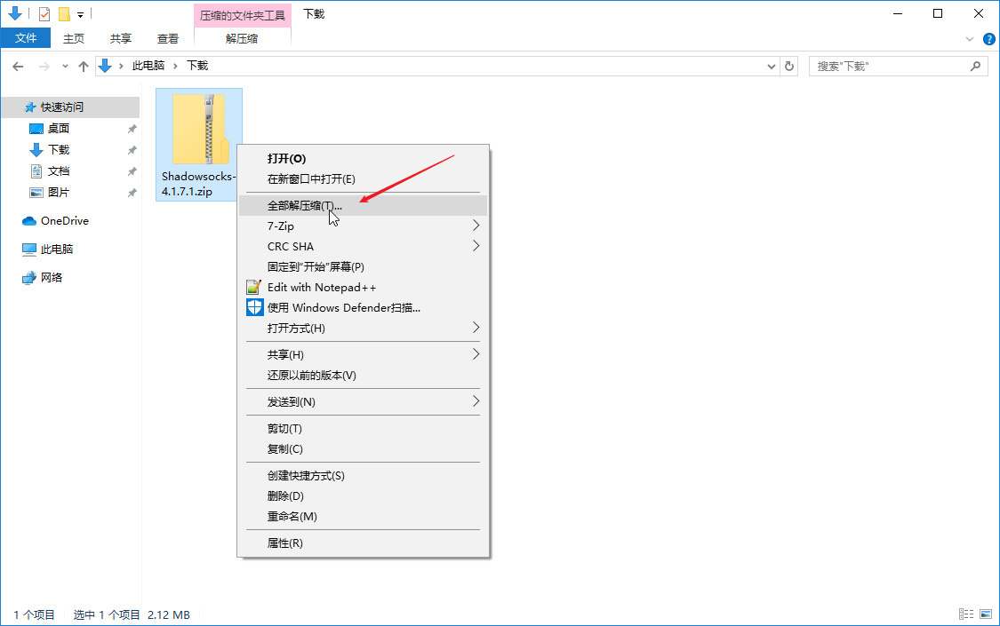

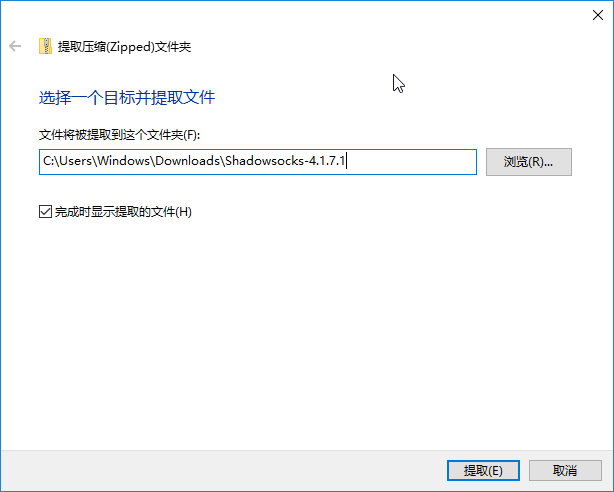

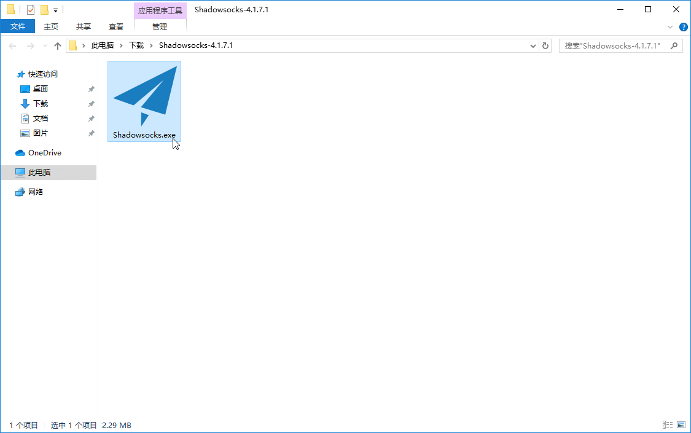

## 配置 Shadowsocks 账号

#### 通过复制 gui-config.json 文件批量添加  
在您的计算机上， 执行下列操作：

**访问 [客户中心使用指南（点我查看）](../../zh_CN/introduction-of-client-portal.md#下载配置文件) 了解如何使用我们的网站下载 `gui-config.json`文件。**

* 将 `gui-config.json` 与 `Shadowsocks.exe` 放在同一个文件目录下。  
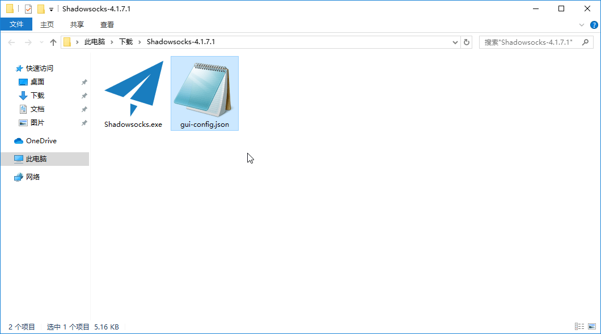

* 双击 `Shadowsocks.exe` > 右键状态栏  >  单击 “服务器”  > 即可看到服务器信息已自动填充完成。  
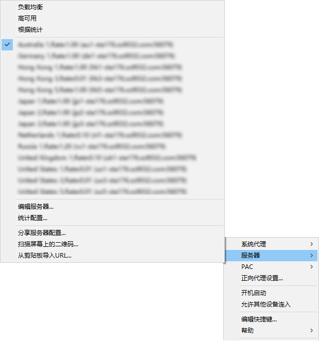

* 右键状态栏 > 确认系统代理没有被禁用。  
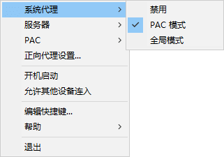

**注：上述截图基于新版本的客户端 [ Shadowsocks-Windows 4.1.5 ] 及更低的版本系统代理选项稍有不同，请拉到页面底部查看对应截图**  

#### 通过二维码方式单独增加节点  
在您的计算机上， 执行下列操作：

**访问 [客户中心使用指南（点我查看）](../../zh_CN/introduction-of-client-portal.md#查看节点二维码) 了解如何使用我们的网站查看二维码。**

此二维码同样适用于其他客户端。

* 右键状态栏 > "服务器” > "扫描屏幕上的二维码"。
* 确认系统代理未选择禁用。  
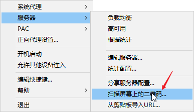

## 配置系统代理模式
* 右键状态栏 > "系统代理" > "PAC模式"。  

* 初次使用需要点击 `PAC` > `从 GFWLIST 更新本地 PAC `，更新成功后会弹出通知   
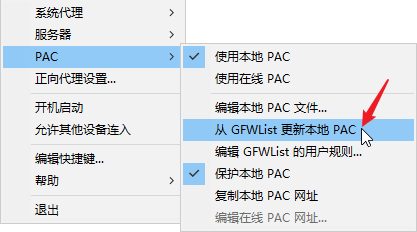   

* 或是直接从本站下载 PAC 文件，请点击 [Pac文件下载](https://portal.shadowsocks.nl/dl.php?type=d&id=14) 下载 pac 配置文件，将  `pac.txt` 文件与 `Shadowsocks.exe` 放在相同的文件目录下。  
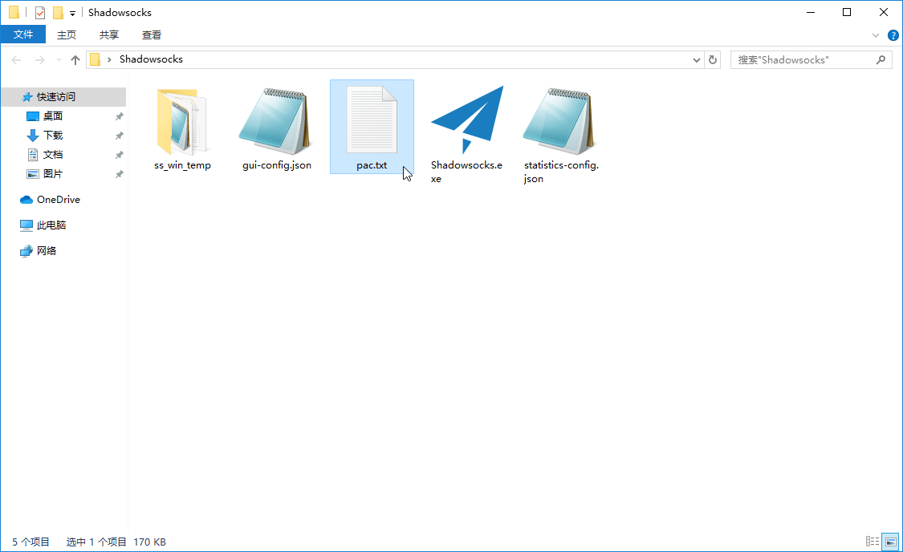

## 注意事项
- **PAC 模式**表示可以实现自动代理， 及本来可以访问的网站不会经过代理，推荐日常使用。
- **全局模式** 表示计算机内大多数流量都会经过代理， 不推荐日常使用。

## 4.1.5 及更低版本客户端的系统代理选项界面
1. 首先需要勾选 `启用系统代理` 的选项  
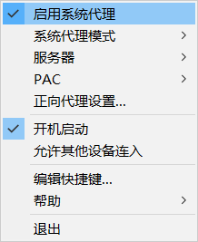

2. 随后可以在 `系统代理模式` 中选择使用 `PAC 模式` 还是 `全局模式`  
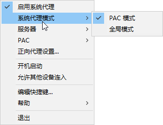

## 	配置 Firefox 的代理

**如需使用 Firefox 浏览器	通过代理浏览网页，请参考下面链接：**  
[Firefox + Proxy SwitchyOmega 设置](../../zh_CN/browser/firefox-setup-guide.md)

## 配置 Chrome 的代理

**如需使用 Chrome 浏览器通过代理浏览网页，请参考下面链接：**  
[Chrome + Proxy SwitchyOmega 设置](../../zh_CN/browser/chrome-setup-guide.md)
