# Windows 下 Clash for Windows 使用教程 
**注：教程中截图对应客户端版本为 Clash for Windows V0.7.10**   
Clash for Windows 支持 Shadowsoks 协议以及 V2Ray 的 vmess 协议

- [Windows 下 Clash for Windows 使用教程](#windows-下-clash-for-windows-使用教程)
    - [下载客户端](#下载客户端)
    - [获取配置](#获取配置)
    - [Clash 主界面介绍](#clash-主界面介绍)
    - [添加配置](#添加配置)
      - [方法 1. 通过链接直接添加](#方法-1-通过链接直接添加)
      - [方法 2. 添加已下载的配置文件](#方法-2-添加已下载的配置文件)
    - [Clash 代理使用介绍](#clash-代理使用介绍)
      - [开启系统代理与开机启动](#开启系统代理与开机启动)
      - [Global 全局规则选项](#global-全局规则选项)
    - [Chrome / Firefox 配合 Proxy SwitchOmega 扩展](#chrome--firefox-配合-proxy-switchomega-扩展)
      - [配置 Firefox 的代理](#配置-firefox-的代理)
      - [配置 Chrome 的代理](#配置-chrome-的代理)

### 下载客户端   
- 从本站 [资源下载](https://portal.shadowsocks.nl/download/category/5/V2Ray-.html) 中下载： [Clash for Windows 点击下载](https://portal.shadowsocks.nl/dl.php?type=d&id=85) | [ClashX(macOS) 点击下载](https://portal.shadowsocks.nl/dl.php?type=d&id=84)  
- Clash for Windows: [Github](https://github.com/Fndroid/clash_for_windows_pkg/releases)  
- ClashX (macOS): [Github](https://github.com/yichengchen/clashX/releases)

### 获取配置  

访问客户中心，依次点击 产品服务 > [我的产品与服务](https://portal.shadowsocks.nl/clientarea.php?action=services
) 打开服务详情。  

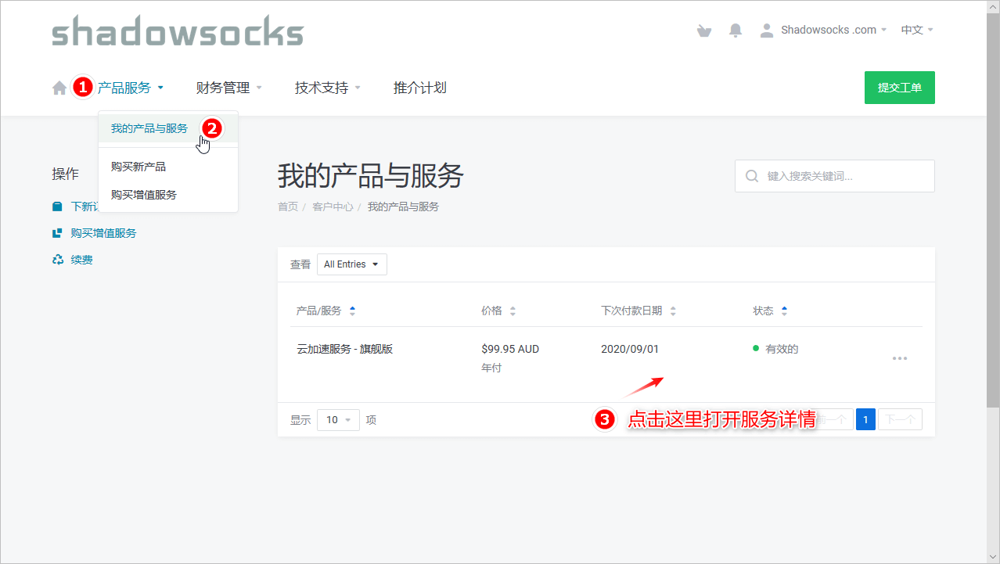

然后打开配置文件下载窗口，获取 Clash 的配置文件（或下载链接）。   
- 可以直接下载文件名为 Shadowsocks_xxx.yaml 配置文件
- 可以在下载按钮上右键复制配置文件下载链接  

注：我们尚未提供订阅链接支持，目前下载链接有效期为 10 分钟

### Clash 主界面介绍
安装后 Windows 可以通过双击通知区域的 Clash for Windows 图标打开主界面  
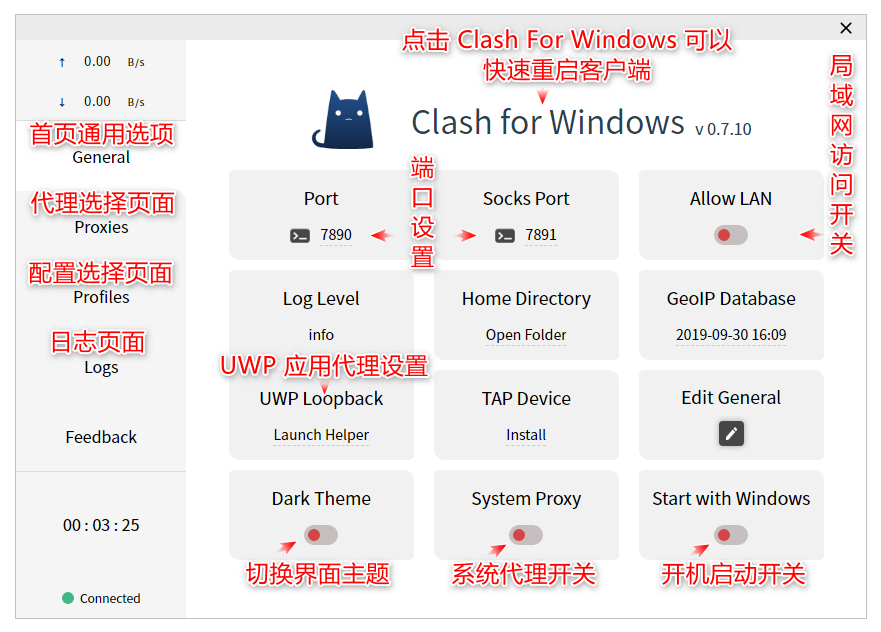

### 添加配置   
首先打开 `Profiles` 配置选择页面，然后进行配置文件的添加
#### 方法 1. 通过链接直接添加
复制 `获取配置` 步骤中得到的配置文件下载链接，粘贴到 `Download from a URL` 输入框内，点击右侧的 `Download` 按钮。  
显示 `Success!` 表示成功添加了配置文件，并且下面会多了一个配置，点击可以切换到对应的配置。  
具体使用方法请参考后面教程。  

注：我们尚未提供订阅链接支持，目前下载链接有效期为 10 分钟  

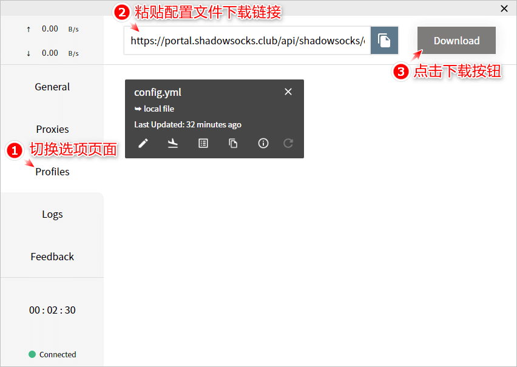  

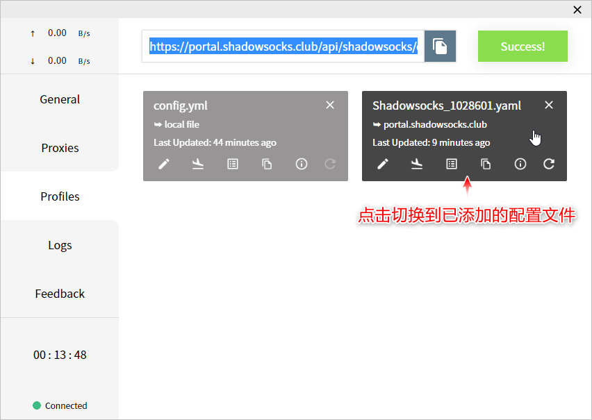

如果切换配置文件时，提示如下错误，表示配置文件不正确，请确认下载链接的有效性  

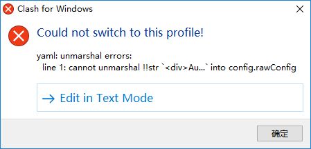

#### 方法  2. 添加已下载的配置文件  
在 `获取配置` 步骤中我们可以下载一个文件名为 Shadowsocks_xxx.yaml 配置文件。  
打开 Clash 的 `Profiles` 配置选择页面，将 Shadowsocks_xxx.yaml 拖入 Clash 中，然后点击切换到刚刚添加的配置文件。   

具体使用方法请参考后面教程。

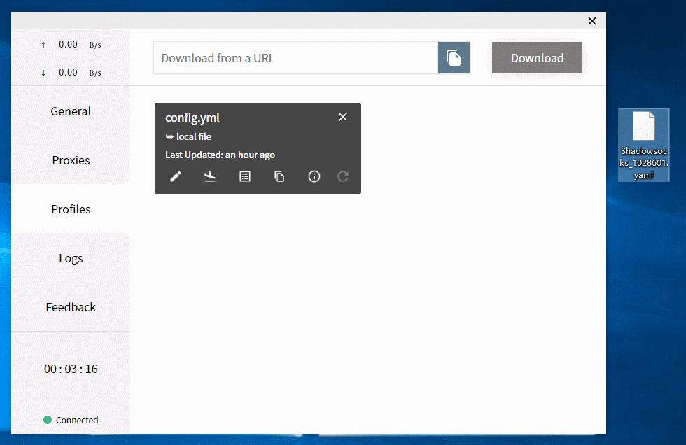  

### Clash 代理使用介绍

#### 开启系统代理与开机启动  
首先打开 `General` 首页页面, 开启系统代理与开机自动启动，然后打开 `Proxies` 代理服务器选择页面。  

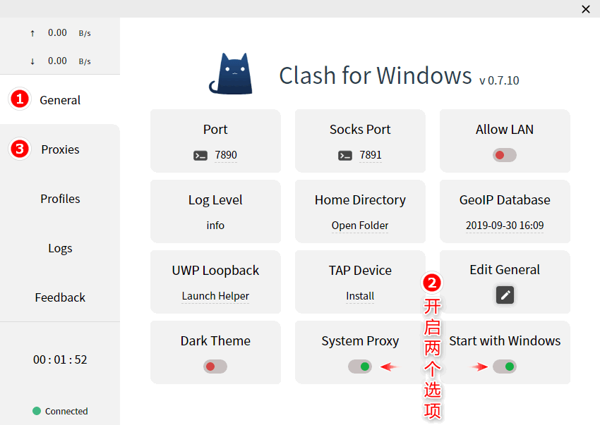   

点击 Global 标签，确认全局规则选择的是最后一个名称为 `Proxy` ，第二行为 `Selector - 节点名称` 的选项即可（ `GLOBAL > Proxy` ），然后点击顶部 `Rule` 标签选择节点。  

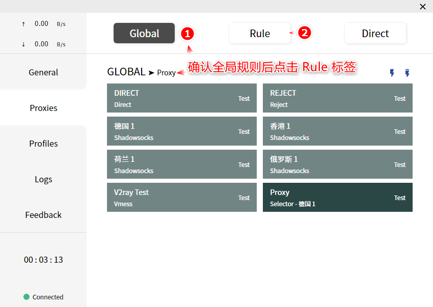    

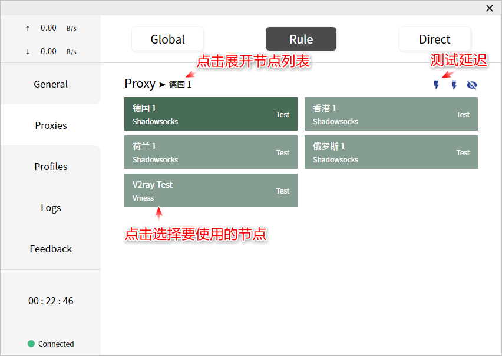

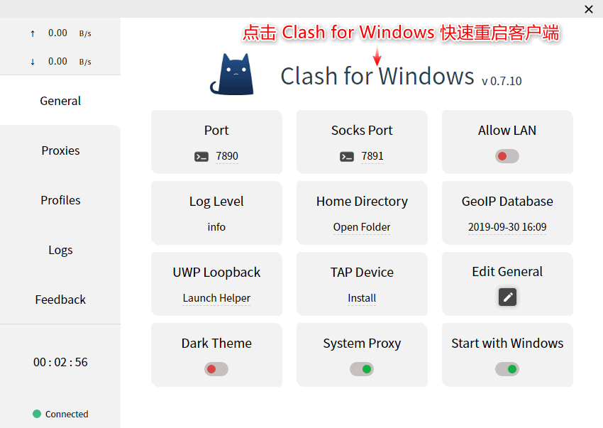

选择节点后可能没有立即生效，建议返回 `General` 首页页面 点击 `Clash for Windows` 字样通过快速重启客户端重新载入配置。  

这时 Clash 已通过设置系统代理的方式进行工作，使用系统代理的软件已可以正常使用。  
可以使用 IE / EDGE / Safari 访问 https://www.google.com 测试  

注： 目前我们节点正在恢复中，建议选择 `V2ray Test` / `德国 1` / `荷兰 1` 节点使用

#### Global 全局规则选项  
Global 页面是设置 Clash 的全局规则，即设置 Clash 如何处理访问请求。
- Direct 表示直接连接，不使用代理    
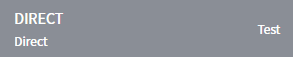  
- Reject 表示全部拒绝访问   
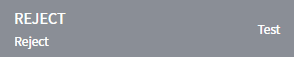    
- Proxy 表示按照配置文件内设置的规则区分是否为访问请求应用代理，类似于 Shadowsocks 的 PAC 模式，可以在 Rule 标签中切换所使用的节点    
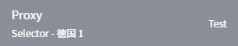  
- 其他直接选中节点表示全部请求均通过代理，类似于 Shadowsocks 的全局模式   
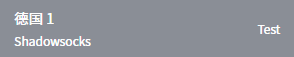  

### Chrome / Firefox 配合 Proxy SwitchOmega 扩展
#### 	配置 Firefox 的代理

**如需使用 Firefox 浏览器	通过代理浏览网页，请参考下面链接：**  
[Firefox + Proxy SwitchyOmega 设置](../../zh_CN/browser/firefox-setup-guide.md)

#### 配置 Chrome 的代理

**如需使用 Chrome 浏览器通过代理浏览网页，请参考下面链接：**  
[Chrome + Proxy SwitchyOmega 设置](../../zh_CN/browser/chrome-setup-guide.md)
