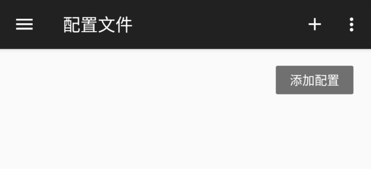
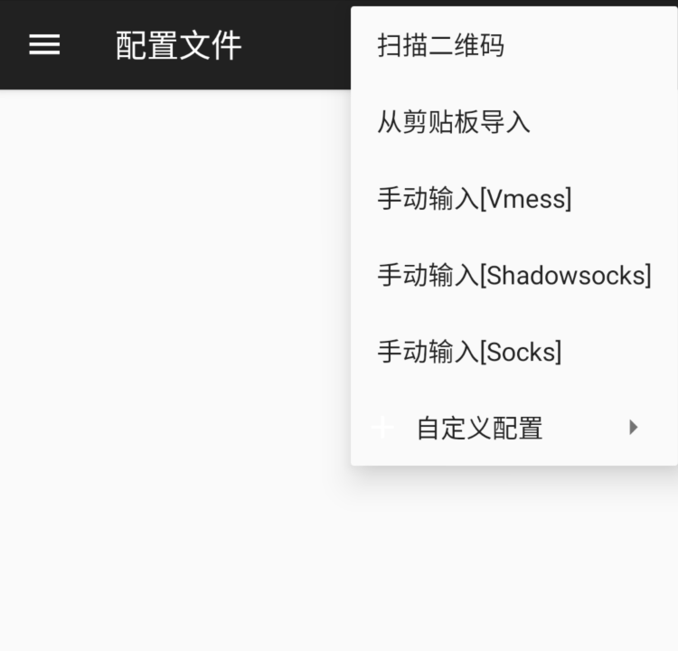
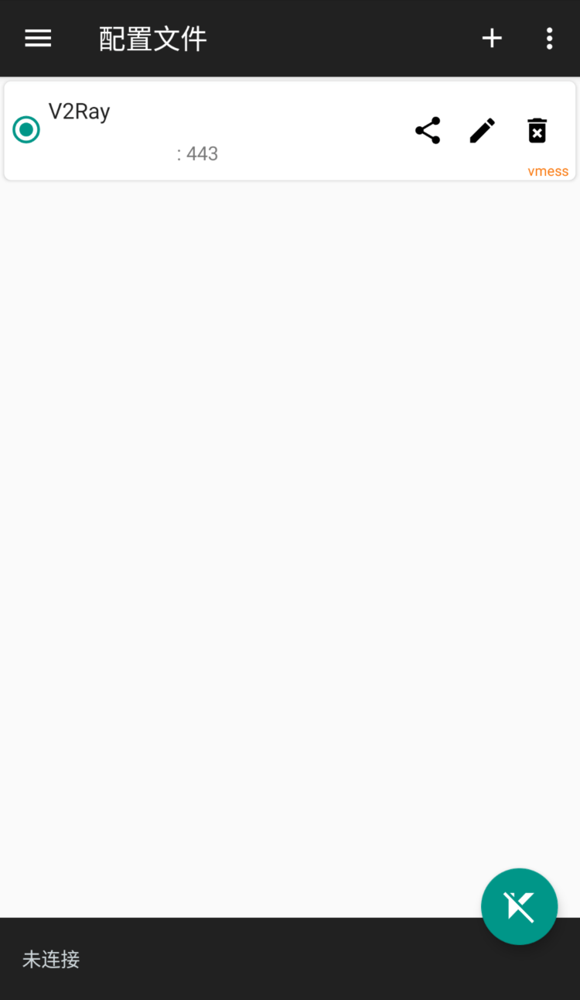
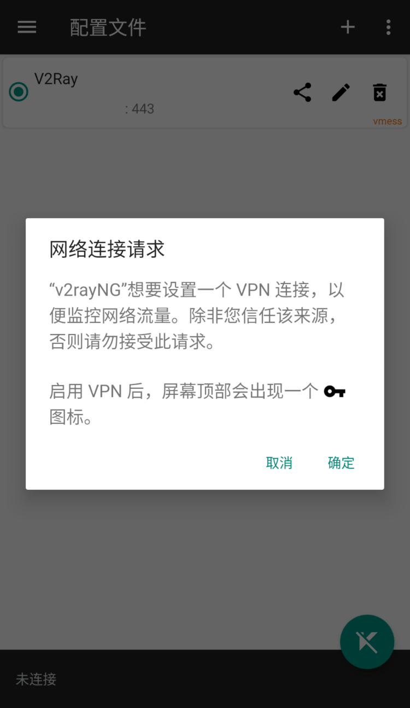
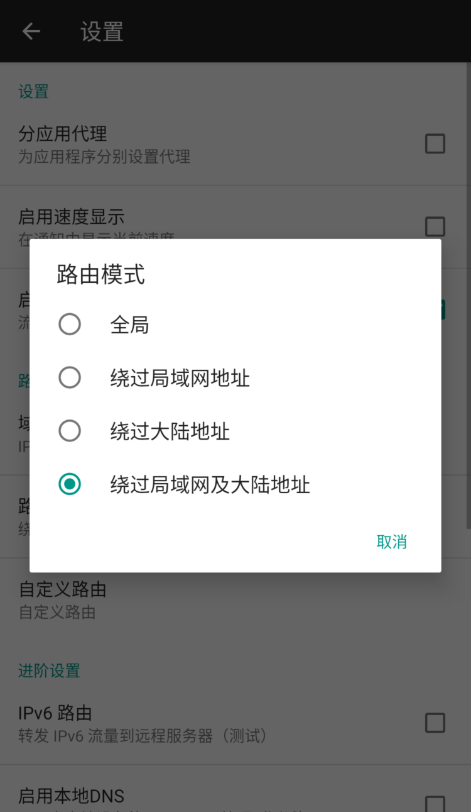

# Android 下 V2rayNG 使用教程
## 下载客户端

- 访问本站下载中心下载
- 从 [Google Play](https://play.google.com/store/apps/details?id=com.v2ray.ang) 下载  
- 访问 Github 下载 : https://github.com/2dust/v2rayNG/releases  

## 查看节点信息
V2ray 节点的配置可以通过点击您的服务详情 -> 服务器列表最下方的 V2Ray[BETA] 按钮查看。 

## 添加服务器
- 复制提供的 vmess:// 链接  
- 点击右上角的 `+` 进入添加服务器的菜单    
  

- 选择添加菜单中的 `从剪贴板导入` 即可完成添加  
    

- 点击右下角的连接按钮，允许 VPN 权限后，启动就可以使用了  
  

- 修改路由模式
主界面左侧滑动，点击设置后，可以设置路由模式，建议选择 `绕过局域网及大陆地址`  
  
