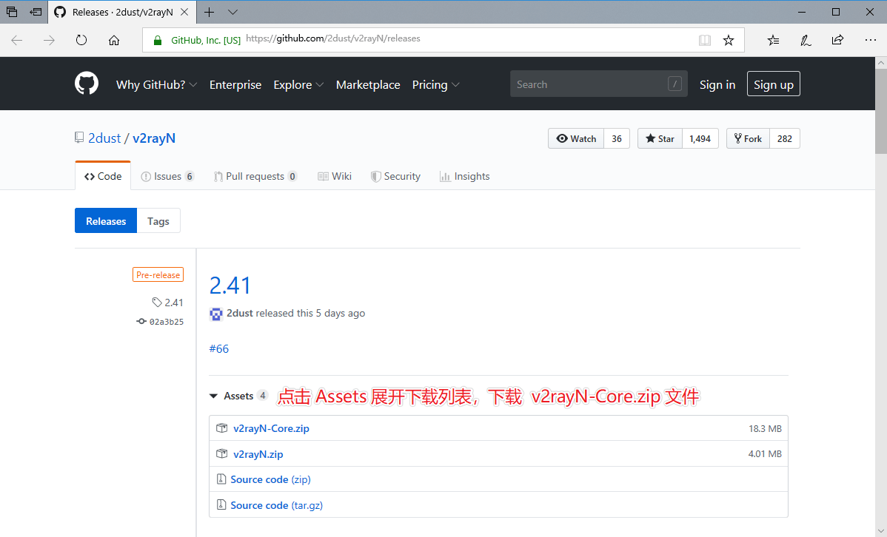
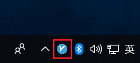
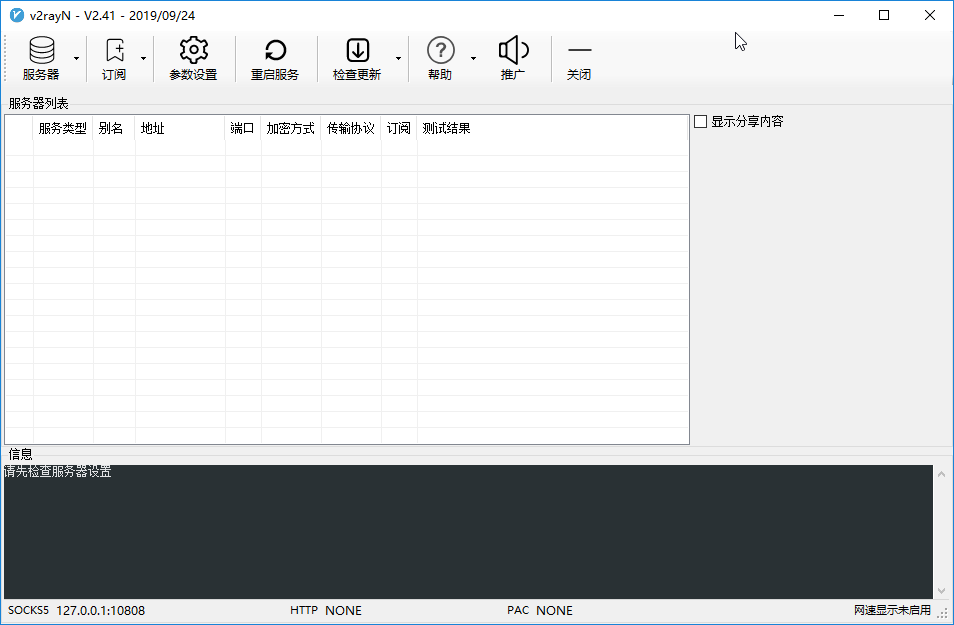
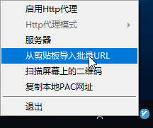
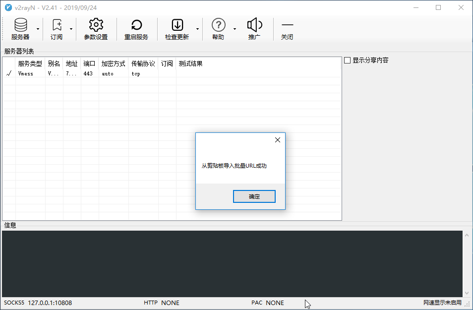
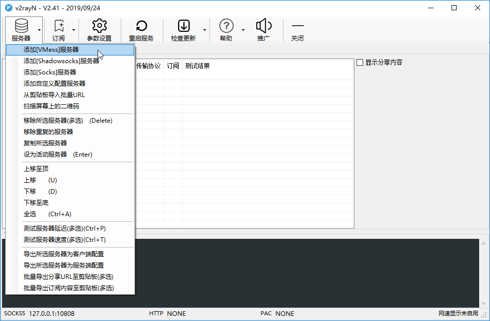
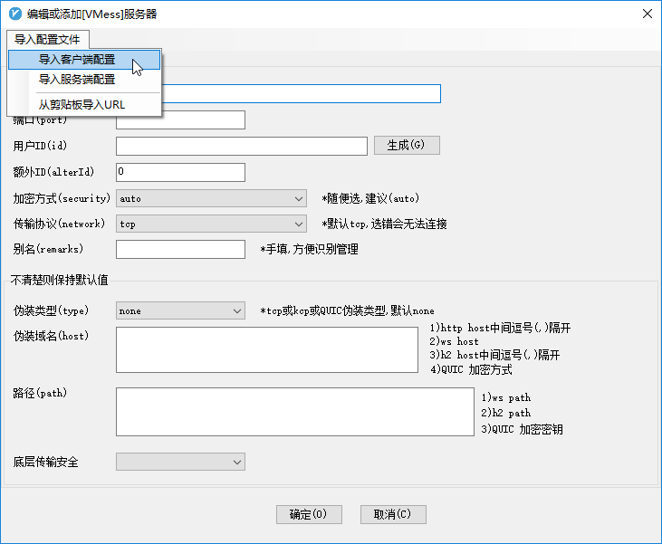
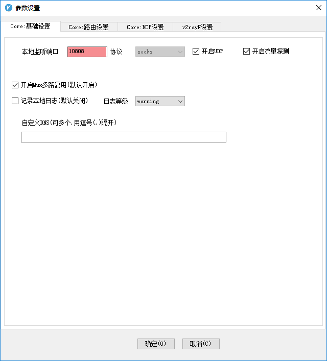

# Windows 下 V2rayN 使用教程 
- [Windows 下 V2rayN 使用教程](#windows-下-v2rayn-使用教程)
  - [1. 下载客户端](#1-下载客户端)
  - [2. 解压文件](#2-解压文件)
  - [3. 添加服务器](#3-添加服务器)
  - [4. v2rayN 的本地监听端口](#4-v2rayn-的本地监听端口)
## 1. 下载客户端

- 访问本站下载中心下载 v2rayN-Core.zip
- 访问 Github 下载
https://github.com/2dust/v2rayN/releases  

## 2. 解压文件
打开解压的文件夹，运行 `v2rayN.exe`
运行后如果没有打开程序主界面，请在 Windows 的通知区域双击 v2rayN 的图标打开。  
  

## 3. 添加服务器  
- 通过 `vmess://` 链接添加  
复制服务器对应的 `vmess://` 链接，在 Windows 的通知区域右键点击 v2rayN 的图标，在弹出的菜单中选择 `从剪贴板中导入批量 url`，会自动完成添加。  
  

- 通过导入配置文件的方式添加  
下载服务器对应的配置文件  
点击服务器图标，选择 `添加[Vmess]服务器`  
在弹出的窗口中，点击左上角的 `导入配置文件` > `导入客户端配置`，选择刚才下载配置文件，即可完成添加。  
  

## 4. v2rayN 的本地监听端口  
v2rayN 本地监听端口默认为 10808 ，可以按照如下的方式修改  
点击客户端首页顶部的参数设置按钮，在弹出的窗口中将本地监听端口由 10808 修改为 1080 ，即可配合以前的 shadowsocks 的浏览器扩展设置进行使用。  

